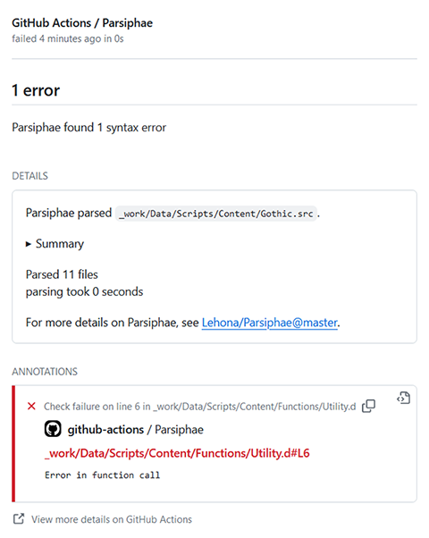
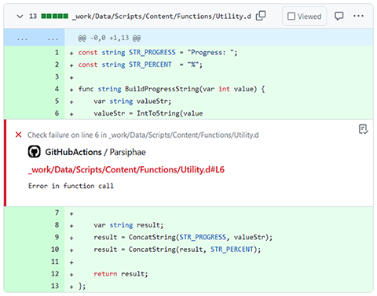
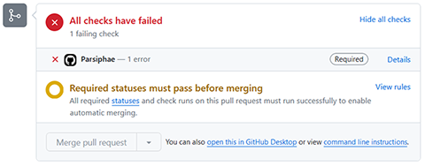

# Parsiphae Action

[](https://github.com/szapp/parsiphae-action/actions/workflows/ci.yml)
[](https://github.com/szapp/parsiphae-action/actions/workflows/ci.yml)
[](https://github.com/marketplace/actions/daedalus-parsiphae)

GitHub action for [Parsiphae](https://github.com/Lehona/Parsiphae), a WIP compiler for the Daedalus scripting language, written by and maintained by [@Lehona](https://github.com/Lehona).

## Checks

Checks are added to commits and performed on pull requests.

### Checks page



### Commit file and line annotations



### Pull request checks



## Usage

Create a new GitHub Actions workflow in your project, e.g. at `.github/workflows/scripts.yml`.
The content of the file should be in the following format:

```yaml
name: scripts

# Trigger workflow on push events with changes in SRC or D files
on:
  push:
    paths:
      - '**.src'
      - '**.d'

# These permissions are necessary for creating the check runs
permissions:
  contents: read
  checks: write

# The checkout action needs to be run first
jobs:
  parsiphae:
    name: Run Parsiphae on scripts
    runs-on: ubuntu-latest
    steps:
      - uses: actions/checkout@v4
      - name: Check scripts
        uses: szapp/parsiphae-action@v1
        with:
          file: _work/Data/Scripts/Content/Gothic.src
          check-name: # Optional (see below)
          cache: # Optional
          token: # Optional
```

## Configuration

- `file`:
  File path within the repository of the D file or the SRC file to parse, e.g. `_work\Data\Scripts\Content\Gothic.src`  
  _Required_

- `check-name`:
  Specify a different name for the check run.
  Useful to differentiate checks if there are multiple instances of this action in one workflow.  
  Defaults to 'Parsiphae'

- `cache`:
  Cache the Parsiphae built in between workflow runs.
  This greatly increases speed of the check as Parsiphae is not cloned and re-built every time.
  The cached executable is specific to the workflow runner OS and the Parsiphae version.  
  Defaults to true

- `token`:
  The `GITHUB_TOKEN` to [authenticate on behalf of GitHub Actions](https://docs.github.com/en/actions/security-guides/automatic-token-authentication#using-the-github_token-in-a-workflow).  
  Defaults to the GitHub token, i.e. checks are created by the GitHub Actions bot.

## Remove second commit status check

The way GitHub check suites are designed, there will be two check statuses attached to a commit when using the 'push' event trigger.
One check status is the actual check run containing the error report and line annotations, the second one is the workflow run.
Unfortunately, the creation of the superfluous workflow check status cannot be suppressed.

One workaround is to delete the entire workflow after the checks have been performed, effectively removing the check status from the commit.
However, this is not possible with the default `GITHUB_TOKEN`, to avoid recursive workflow runs.
To remove the additional status check, call this GitHub Action with an authentication `token` of a GitHub App and enable the `check_run` event with `completed` (see below).
For more details the issue, see [here](https://github.com/peter-murray/workflow-application-token-action#readme).
Always leave the additional input `cleanup-token` at its default.

Nevertheless, this is a optional cosmetic enhancement and this GitHub action works fine without.

```yaml
name: scripts

on:
  push:
    paths:
      - '**.src'
      - '**.d'
  check_run:
    types: completed

permissions:
  contents: read
  checks: write
  actions: write

jobs:
  parsiphae:
    name: Run Parsiphae on scripts
    if: github.event_name != 'check_run' || startsWith(github.event.check_run.name, 'Parsiphae') # Adjust to check name
    runs-on: ubuntu-latest
    steps:
      - uses: actions/create-github-app-token@v1
        id: app-token
        with:
          app-id: ${{ vars.APP_ID }} # GitHub App ID
          private-key: ${{ secrets.APP_KEY }} # GitHub App private key
      - uses: actions/checkout@v4
      - name: Check scripts
        uses: szapp/parsiphae-action@v1
        with:
          file: _work/Data/Scripts/Content/Gothic.src
          check-name: # Optional (see below)
          cache: # Optional
          token: ${{ steps.app-token.outputs.token }}
```
